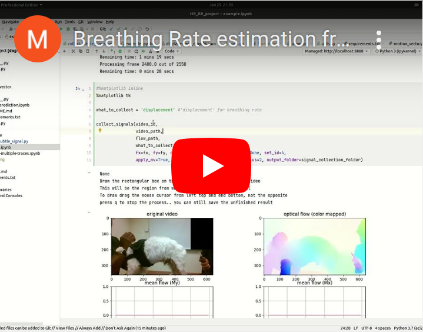
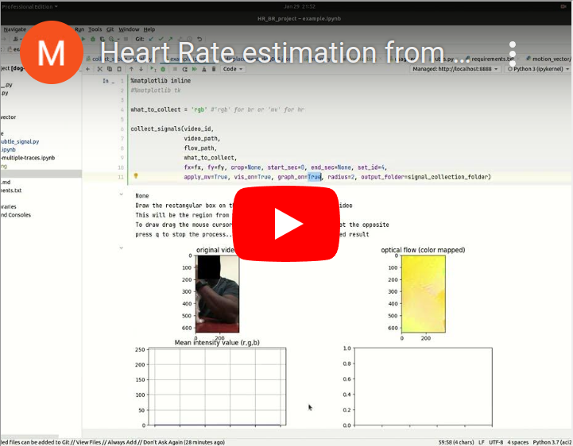

# Contact-Free Sensing of Human Heart Rate and Canine Breath rate

Can we estimate <b>canine breath rate</b> from canine videos? Or <b>human heart rate</b> from subtle skin color change of human face/hand? Using advanced computer vision techniques (optical flow, object tracking) and robust frequency estimation techniques we get the answer is "YES" for both cases.

This repository contains the codes used in the following paper: 

[Contact-Free Simultaneous Sensing of Human Heart Rate and Canine Breathing Rate for Animal Assisted Interactions](https://arxiv.org/abs/2211.03636)<br/>

# Video-based Breathing Rate estimation

### Step 1: selecting a region on GUI targeting the dog's belly region


### Step 2: optical flow estimation and signal processing (Automatic)

### Step 3: robust frequency estimation (Automatic)


# Video-based Heart Rate estimation

### Step 1: selecting a region on GUI targeting the dog's belly region


### Step 2: optical flow estimation and signal processing (Automatic)

### Step 3: robust frequency estimation (Automatic)


## Environments
The requirements have been tested in python 3.8. So, run this repository with zero code change we suggest to use python 3.8 first. Use the below command to install python 3.8 in anaconda first:  
```Shell
conda create -n "hr_br_est_aci_22" python=3.8
conda activate hr_br_est_aci_22
pip install -r requirements.txt
```
## Usage
There are three main front-end files in this repository.

`main.py` reproduces the result presented in the [paper](https://arxiv.org/abs/2211.03636). It estimates breath rate for three video files and heart rate for four video files. The original video files are not publicly available for privacy concerns, but the intermediate files (extracted signals) are shared. `main.py` uses these results from `outputs/` directory.

`example.ipynb` shows step-by step processes how to get breathing rate or heart rate from a sample video file. You will need to update the variable of video file path to the location of video file stored in your storage.

`example-multiple-traces.ipynb` reproduces the figure 9 of our [paper](https://arxiv.org/abs/2211.03636). This shows how our video-based breathing rate estimation technique can also work under the presence of another strong distracting periodic motion signal.

## Video Tutorial on `example.ipynb`


[](https://www.youtube.com/watch?v=a5zla8ph0jc)
[](https://www.youtube.com/watch?v=0y8mZ19Kf9k)


## Citation

If you use our code, please cite our paper:

@article{holder2022contact,<br>
  &ensp;&ensp;title={Contact-Free Simultaneous Sensing of Human Heart Rate and Canine Breathing Rate for Animal Assisted Interactions},<br>
  &ensp;&ensp;author={Holder, Timothy and Rahman, Mushfiqur and Summers, Emily and Roberts, David and Wong, Chau-Wai and Bozkurt, Alper},<br>
  &ensp;&ensp;journal={arXiv preprint arXiv:2211.03636},<br>
  &ensp;&ensp;year={2022}<br>
}

## Acknowledgement
1. [Global Motion Aggregation](https://github.com/zacjiang/GMA)
2. [Adaptive Multi-Trace Carving for Robust Frequency
Tracking in Forensic Applications](https://ieeexplore.ieee.org/stamp/stamp.jsp?arnumber=9220114)
